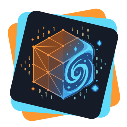
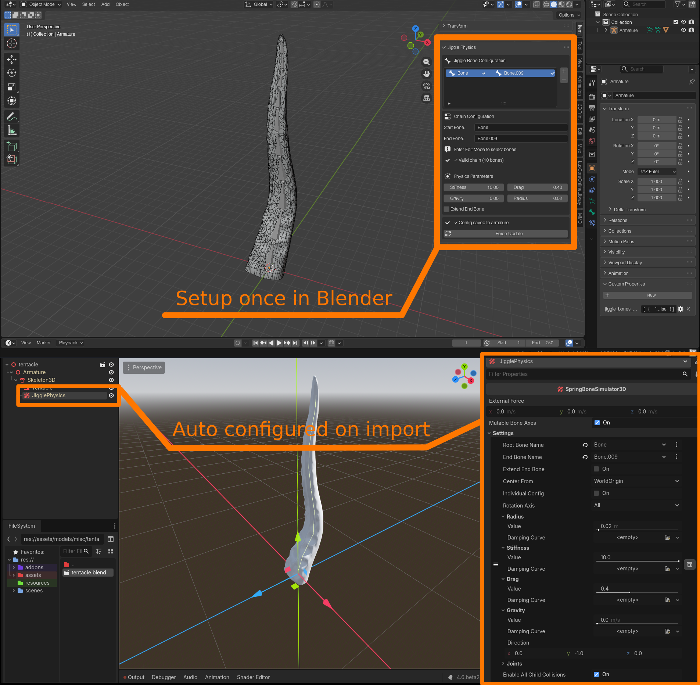

# Metamagic

<table>
<tr>
<td width="128px">

</td>

<td>

_Advancing blender to godot pipeline with metadata!_

</td>
</tr>
</table>

**Metamagic** is a powerful dual-sided toolkit designed to bridge the gap between **Blender** and **Godot 4**. It allows you to attach game-logic metadata directly to your Blender objects and automates tedious setup routines during the import process.

> **Stop configuring physics manually every time you re-import.** Configure it once in Blender, and let Metamagic handle the rest.

---

## Features

### Automated Jiggle Physics

1.  **Configure in Blender:** Select your armature, open the **Metamagic** panel (N-Panel), and set up your jiggle chains (hair, tails, clothing).
2.  **Export:** Save as `.blend` or export to gltf.
3.  **Done:** Godot automatically detects the metadata and generates the necessary physics nodes with your exact settings (Stiffness, Drag, Gravity, etc.).

