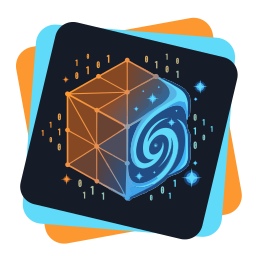
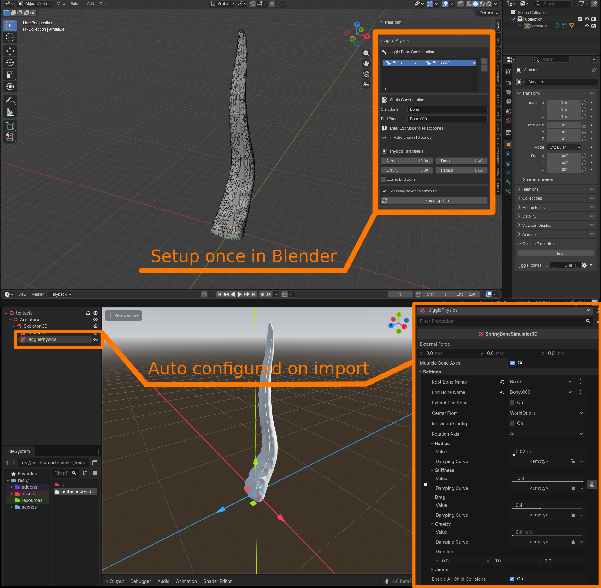
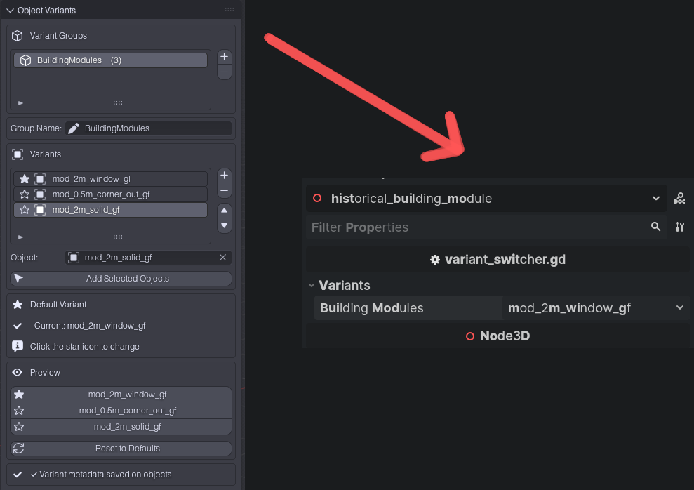
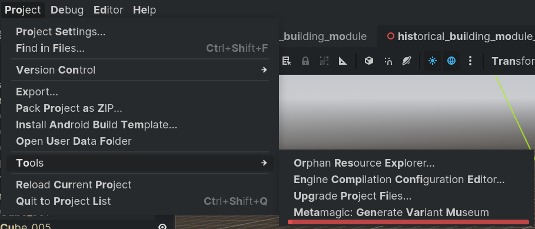
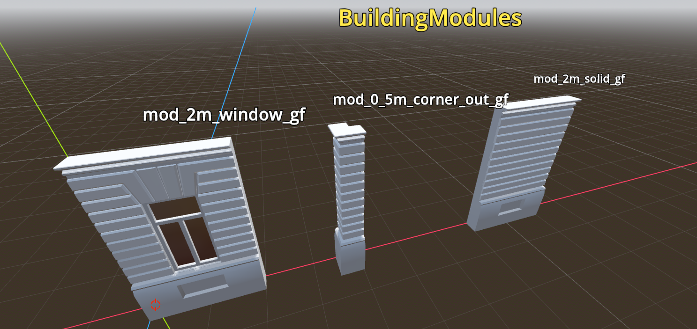

# Metamagic

<table>
<tr>
<td width="128px">

</td>

<td>

_Advancing blender to godot pipeline with metadata!_

</td>
</tr>
</table>

**Metamagic** is a handy toolkit that bridges **Blender** and **Godot 4** by letting you tag your Blender objects with special metadata that Godot understands. No more manually setting up physics or bone attachments every time you re-import your models—configure it once in Blender, and Metamagic handles the rest automatically.

> ⚡ **The magic happens automatically**—just export from Blender and watch Godot do the heavy lifting!

---

## Features

### 🦴 Bone Attachments

Ever wanted to attach a sword, helmet, or any prop to a specific bone in your character's skeleton? Metamagic makes this super simple:

1. **Select your object** in Blender (the mesh, empty, or whatever you want to attach)
2. **Open the Metamagic panel** (N-panel in the 3D viewport)
3. **Pick the armature** and **bone** you want to attach to
4. **Click "Snap to Bone"** (optional) if you want to perfectly align your object to the bone's pivot in Blender.
5. **Export** to Godot
6. **Boom!** The object is now parented to a `BoneAttachment3D` node in Godot, following the bone animation perfectly while keeping its relative offset!

This is perfect for things like:
- Weapons attached to hands
- Accessories attached to heads
- Props attached to specific body parts
- UI elements that need to follow bone movement

### 🌊 Automated Jiggle Physics

Make your character's hair, tails, clothes, or floppy ears bounce naturally without writing a single line of code in Godot:

1. **Configure in Blender:** Select your armature, open the **Metamagic** panel (N-Panel), and set up your jiggle chains
2. **Export:** Save as `.blend` or export to gltf
3. **Done:** Godot automatically generates physics nodes with your exact settings (Stiffness, Drag, Gravity, etc.)

### 🎛️ Object Variants

Store multiple versions of an object in a single `.blend` file and switch between them in the Godot editor with a dropdown—no duplicate scenes, no manual show/hide juggling:

1. **Group your variants in Blender:** Open the **Metamagic** panel, create a Variant Group, select your objects (e.g. `mod_2m_window_gf`, `mod_0.5m_corner_out_gf`, `mod_2m_solid_gf`) and click **Add Selected Objects**
2. **Pick a default:** Click the ★ star icon next to the variant that should be visible by default
3. **Export:** Save as `.blend` or export to glTF
4. **In Godot:** Right-click the `.blend` file in the FileSystem dock → **New Inherited Scene**, save it to disk
5. **Switch variants:** The scene root gets a **Variants** section in the Inspector with a dropdown for each group—pick any variant and it swaps instantly

**How it works:**
- Each member object gets a `metamagic_variant` custom property (JSON) that survives the glTF round-trip as extras
- On import, Godot's post-import plugin reads the metadata, hides non-default variants, and attaches a `@tool` script to the scene root
- The tool script uses `_get_property_list()` to dynamically expose enum dropdowns in the Inspector
- Your choice persists across scene save/load via `@export_storage`

**Smart features:**
- Preview any variant in Blender's viewport without changing the default
- Viewport preview uses temporary hide (`hide_set`) so transforms and modifiers are always fully evaluated—no broken exports
- Preview state restores automatically when reopening the `.blend` file
- An object can only belong to one variant group (the addon warns you if you try to double-assign)
- Removing a group or member automatically un-hides everything so nothing gets stuck invisible

#### 🏛️ Variant Museum

Need to see all your variants at a glance? Turn any inherited scene into a **museum layout** — all variants visible, spaced out so nothing overlaps, with 3D labels telling you what's what.

1. Right-click your `.blend` file in Godot's FileSystem dock → **New Inherited Scene**
2. Save the inherited scene to disk (**Ctrl+S**)
3. Go to **Project > Tools > Metamagic: Generate Variant Museum**

The tool modifies the current scene in-place — no duplicate files. It computes mesh bounding boxes to space variants properly, adds white `Label3D` captions per variant and gold group headers above each row. Multiple variant groups get laid out as separate rows. Running the tool again cleans up previous labels first, so it's safe to re-run. Great for QA, art reviews, or just admiring your work!

### 🔄 Rotation Chain Utilities

Create bone rotation constraints with a single click—great for additive animations or procedural stuff:

1. **Select Bones:** Go to Edit Mode and pick a chain of bones (at least 2) in your armature
2. **Create Chain:** Hit the "Create Rotation Chain" button in the **Utilities** section
3. **Done:** Metamagic adds Copy Rotation constraints to each bone (except the topmost one), all set to LOCAL space for nice additive rotations

**Smart features:**
- Automatically finds the topmost bone in your selection
- Follows the bone hierarchy from parent to child
- Warns you if it detects branching (so you don't get weird results)
- Updates existing constraints instead of making duplicates

---

## Installation

### Download

Grab the latest release from the [GitHub Releases page](https://github.com/metdxt/metamagic/releases). You'll get two zips:

- **`metamagic_blender.zip`** - The Blender addon
- **`metamagic_godot.zip`** - The Godot addon

### 1. Blender Setup

1. Open Blender and hit **Edit > Preferences**
2. Click the **Add-ons** tab
3. Hit **Install...** and pick `metamagic_blender.zip`
4. Check the box next to **Metamagic** to enable it

**Quick test:**
- Select an armature
- Press `N` to open the sidebar
- Look for the **Metamagic** tab—should be there!

### 2. Godot Setup

1. Open your Godot project
2. Extract `metamagic_godot.zip` (or just grab the `metamagic` folder inside)
3. Drop it into your project's `addons/` folder
4. Go to **Project > Project Settings > Plugins**
5. Toggle on **Metamagic**

**Quick test:**
- Import a `.blend` or `.gltf` that you exported from Blender with Metamagic metadata
- Check that your physics nodes or bone attachments showed up automatically

**Note:** If you had assets in your project before installing Metamagic, you'll need to reimport them for the magic to happen. New imports work automatically—no extra steps needed!

---

## Quick Start Guide

### Setting Up Bone Attachments

Want to attach a sword to your character's hand?

1. Select your sword mesh in Blender
2. In the Metamagic panel, pick the character's armature
3. Choose the "Hand.R" (or whatever bone you want)
4. Export to Godot
5. Your sword is now properly parented and follows hand animation!

### Setting Up Object Variants

Want to ship one building module with multiple wall styles?

1. Set up your variants as separate objects in Blender (e.g. empties parenting different meshes)
2. In the Metamagic panel, go to **Object Variants** and click **+** to create a group
3. Give it a name like "WallStyle"
4. Select all the variant objects in the viewport, then click **Add Selected Objects**
5. Click the ★ next to the one you want as the default
6. In Godot, right-click the `.blend` → **New Inherited Scene**, save it
7. Pick your wall style from the **Variants** dropdown in the Inspector!

### Generating a Variant Museum

Want to see every variant side by side for review?

1. Right-click the `.blend` file → **New Inherited Scene**, save to disk (**Ctrl+S**)
2. Go to **Project > Tools > Metamagic: Generate Variant Museum**
3. Done! The scene is rearranged with all variants visible, spaced out, and labelled — re-run any time to refresh

### Configuring Jiggle Physics

Making some bouncy... hair?

1. Select your character's armature
2. In the Metamagic panel, add a new chain
3. Set the start and end bones (e.g., "Hair_Start" to "Hair_End")
4. Tweak stiffness, drag, and gravity until it feels right
5. Export and watch it bounce in Godot!

---

## Tips & Tricks

- **Metadata sticks:** The configuration is saved in your Blender file, so you can always come back and tweak it.
- **Perfect Transforms:** Metamagic preserves the relative offset between your object and the bone. No more visual "jumps" on import!
- **Snap to Bone:** Use the "Snap to Bone" button in Blender to instantly align your prop's origin and rotation with the target bone.
- **Non-destructive:** Metamagic doesn't modify your actual mesh or armature, it just adds metadata.
- **Variant preview:** Use the Preview buttons in the Variants panel to quickly cycle through variants in Blender without changing which one is the default.
- **Variant museum:** Convert any variant scene into a museum layout in Godot (**Project > Tools**)—safe to re-run, perfect for art reviews or QA passes.
- **Multiple chains:** You can have as many jiggle chains, bone attachments, or variant groups as you need.
- **Export anywhere:** Whether you save as `.blend` or export to GLTF, Metamagic's metadata comes along for the ride.

---

## Got Issues?

Found a bug or have a feature request? Open an issue on GitHub!
